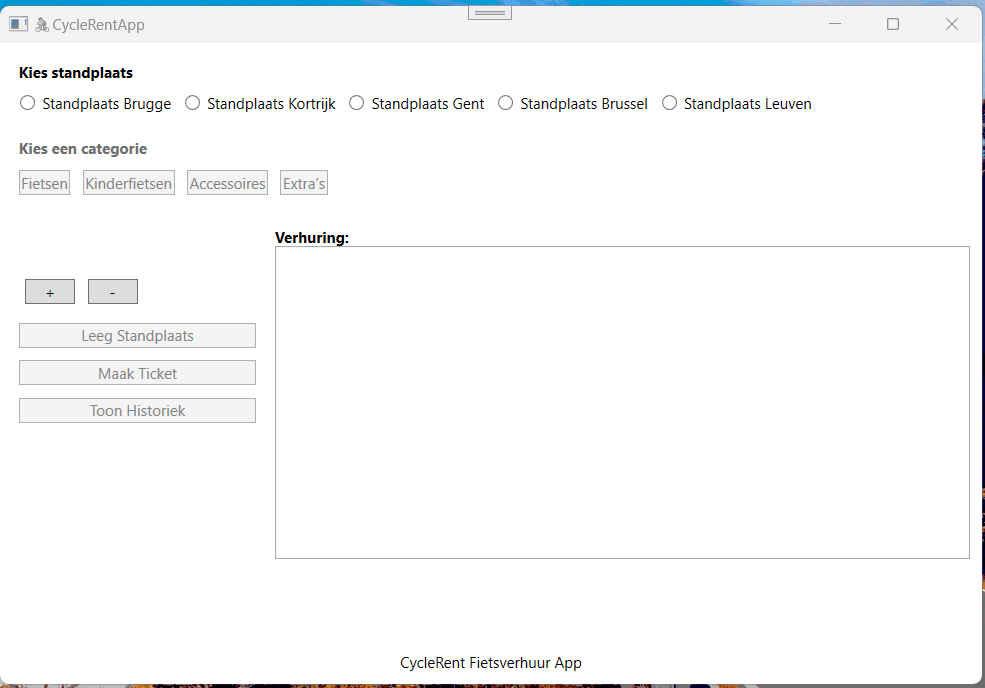

# PE02: Fietsverhuur-app (WPF,.NET 8,C#)

### Gebruik van AI Tools
Er mag geen enkele AI tool (ChatGPT, GitHub Copilot, …) gebruikt worden voor deze opdracht. Bij twijfel over ongeoorloofd gebruik kan het lectorenteam extra verduidelijking vragen. Ongeoorloofd gebruik leidt tot het opstarten van een fraudedossier conform het onderwijs- en examenreglement, met mogelijke nulscore op één of meer opleidingsonderdelen.

## 1. Opdrachtomschrijving

Maak voor de fietsverhuurder **"CycleRent"** een WPF-applicatie die het personeel gemakkelijk maakt om fietsverhuringen bij te houden en om een overzichtsticket aan te maken.

* Er zijn **5 verhuurstandplaatsen** (Brugge, Kortrijk, Gent, Brussel, Leuven)
* Klanten kunnen kiezen uit verschillende soorten fietsen en accessoires.

### Aanbod

**Fietsen:**

* Stadsfiets: 10 euro
* Mountainbike: 15 euro
* Racefiets: 20 euro
* Elektrische fiets: 25 euro

**Kinderfietsen:**

* Kinderfiets klein: 7 euro
* Kinderfiets groot: 9 euro

**Accessoires:**

* Fietshelm: 3 euro
* Kinderzitje: 4 euro
* Fietstas: 5 euro

**Extra’s:**

* Regenjas: 6 euro
* Slot: 2 euro

Medewerker kan elk verhuurartikel via de applicatie registreren.

* Medewerker kiest de juiste standplaats door op de juiste knop te klikken.
* Vervolgens kan het gekozen artikel aan de huurlijst worden toegevoegd.
* Het is mogelijk fouten te corrigeren (bijv. verkeerd artikel of aantal).
* De huurlijst van elke standplaats wordt in het geheugen bewaard.
* Bij afrekenen kan het overzichtsticket aangemaakt worden.
* Er is een mogelijkheid om de huurlijst volledig te wissen.

### Programming tip:
Denk eraan dat je bij **List** en **Dictionary** de datatypes van de waarden (en sleutels voor Dictionary) vrij kan kiezen. Dit is dus niet beperkt tot primitieve datatypes, maar kunnen ook complexere datatypes zijn. Op die manier kan je bv. **collecties van collecties** maken (geneste collecties) wat zeker van pas zal komen bij deze opdracht.

### XAML
Bij deze opdracht krijg je de xaml-code. Alle controls zijn reeds aanwezig en hebben reeds een naam.
Je mag de namen van de controls niet wijzigen.
Je hoeft ook geen controls toe te voegen.

## 2. De applicatie

### Bij het opstarten

* Alleen de 5 radiobuttons voor de standplaatsen zijn ingeschakeld.

### Bij selecteren van een standplaats

* Worden de knoppen **Fietsen**, **Kinderfietsen**, **Accessoires** en **Extra’s** ingeschakeld.
* De combobox blijft **verborgen** tot een categorie gekozen is.
* De huurlijst van de gekozen standplaats verschijnt bij **Verhuring**.

### Verhuring opnemen

* Medewerker kiest een standplaats.
* Medewerker kiest een artikelcategorie.
* Medewerker kiest een artikel in de combobox.
* Met **+** toevoegen, met **-** verwijderen.
* Als het aantal 0 wordt, verdwijnt het artikel.
* De huurlijst toont:

  * StandplaatsNaam
  * Gehuurde artikelen met aantallen en eenheidsprijzen
  * Totaalbedrag
* Wisselen van standplaats haalt automatisch de juiste gegevens op.

## 3. Overzichtsticket

* Het overzichtsticket verschijnt in een **MessageBox**.

## 4. Standplaats leegmaken

* Het personeel kan een huurlijst volledig wissen voor de gekozen standplaats.

## 5. Extra’s

* **Bevestiging bij wissen (💪💪💪)**: dialoogvenster bij leegmaken.
* **Geen verhuring voor gekozen standplaats (💪)**: indien nog niets gehuurd, melding bij Verhuring.
* **Geen artikelen → knoppen uitgeschakeld (💪💪)**: knoppen Leegmaken en Maak Ticket zijn inactief.
* **Default categorie = 'Fietsen', default product = 'Stadsfiets' (💪)**: bij keuze van een andere standplaats.
* **Corrigeren van een verhuring (💪💪💪)**: knop - uitgeschakeld zolang artikel niet op de lijst staat.
* **Weergeven van de verhuringen van de dag (Historiek) (standplaats overschrijdend) (💪💪💪💪)**: Hierbij kan je een historiek opvragen van alle verhuringen per standplaats. Deze historiek wordt weergegeven in een messagebox.(zie demo). De knop blijft **uitgeschakeld** tot er een item verhuurd wordt.

## 6. Demo

* De demo toont hoe medewerkers via de standplaats-knoppen fietsen en accessoires toevoegen, corrigeren en het overzichtsticket genereren.

## 

## 7. Inleveren
- **Commit** je definitieve versie voor de deadline op de **Main-branch** van deze repository.

## 8. Integriteitsnota
Werk **zelfstandig**. Je moet al je code en keuzes kunnen **toelichten**.