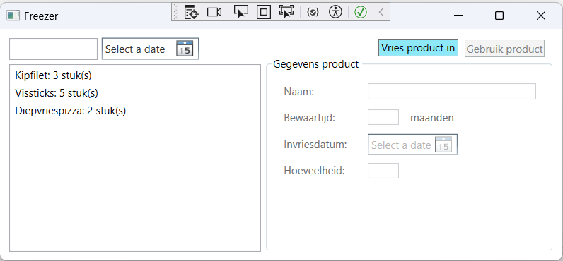
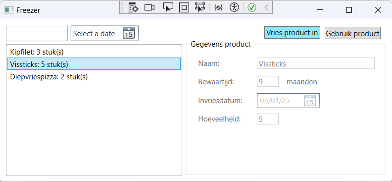
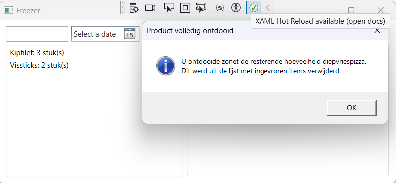
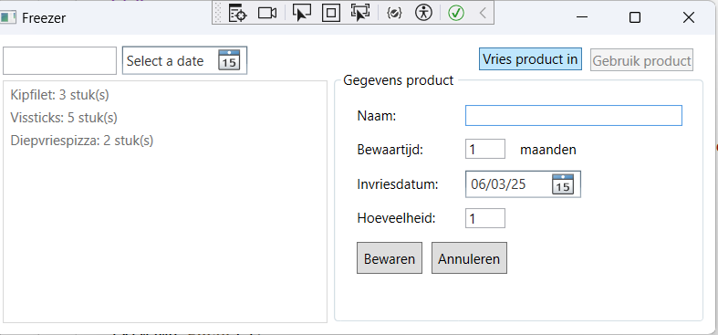

# PE1: Freezer

In deze opdracht gaan we aan de slag met eigen klassen en objecten.
We maken een programma om je diepvriesvoorraad te beheren.
In het bijzonder willen we bijhouden hoe lang elk product bewaard kan blijven,
zodat we nooit voedsel verspillen en altijd producten gebruiken binnen hun houdbaarheid.

Bekijk eerst onderstaande animatie van het eindresultaat.

## Functionaliteit

### Opstarten programma

Zorg ervoor dat er bij het opstarten van het programma automatisch al wat voorbeelddata wordt aangemaakt.
Je mag je hiervoor baseren op de data uit de animatie of zelf iets verzinnen.
De voorradige producten worden in een lijst getoond, met vermelding van het aantal.  

### Detailgegevens product

Wanneer je een product aanklikt in deze lijst krijg je in het rechterpaneel de detailgegevens ervan te zien.
Deze zijn echter niet aanpasbaar.  
Wanneer er een product in de lijst geselecteerd is, wordt de knop "Gebruik product" actief.  
  

### Product gebruiken

Door op de knop "Gebruik product" te klikken,  kan je aangeven dat je een portie of verpakking uit de diepvries hebt gehaald,
waardoor het aantal stuks vermindert met 1. 

**Opgelet:** wanneer je de laatste portie van een product gebruikt, verdwijnt dit product automatisch uit de voorraadlijst en krijg je een melding te zien:

### Product toevoegen

Met de blauwe knop "Vries product in" kan je een nieuw diepvriesproduct registreren.
Nadat je op deze knop klikt, zijn alle invoervelden aanpasbaar. Er staat in de lijst met producten geen enkel product meer geselecteerd.
Het naam-veld is leeg en hier staat de cursor klaar. Bewaartijd en hoeveelheid bevatten standaard de waarde 1, de invriesdatum is standaard steeds de huidige datum. 
En verschijnen ook 2 knoppen onderaan het rechterpaneel: "Annuleren" & "Bewaren".

  
Alle gegevens dienen correct ingevuld te worden, anders krijg je een foutmelding bij het klikken op "Bewaren". Meer info hierover kan je verderop lezen in de uitleg over de klassen in de klassenbibliotheek. Bij het bewaren staat het nieuw toegevoegde product ook automatisch geselecteerd in de lijst met diepgevroren producten. In het rechterpaneel zijn de detailgegevens ervan te zien.Deze zijn echter niet aanpasbaar.De knop "Gebruik product" is actief. De knoppen "Bewaren" en "Annuleren" verdwijnen.

Je kan het invriezen ook annuleren. (Zie gif)

### Voorraad filteren

Je kan op twee manieren de stock filteren:
- Links bovenaan in het tekstvak boven de lijst kan je een zoekterm ingeven voor de naam van het product.
  **Opgelet:** deze werkt **hoofdletterongevoelig**. Als je "kip" intikt moet dus bv. "Kipfilet" ook in de resultaten verschijnen.
- Naast het tekstvak is een date picker waarmee je de lijst kan filteren op uiterste houdbaarheidsdatum.
  Als je hier een datum invult, krijg je enkel de producten te zien die op die datum nog veilig te gebruiken zijn,
rekening houdend met de invriesdatum en de maximale bewaartijd.  

Je kan beide filters ook combineren.  

Door te klikken op de "verwijder filter" knop worden de filterinputs leeg gemaakt en zijn terug alle producten zichtbaar.

**Tip!** Dit is het moeilijkste onderdeel van de opdracht.
We raden sterk aan om eerst de andere onderdelen uit te werken en pas naar de filter te kijken wanneer de rest klaar is.
Ook zonder de filter kan je slagen voor de opdracht (zie rubric op Leho).  

## Technische informatie

De solution bevat reeds een WPF project met XAML code.
### WPF Project

De WPF layout is volledig voorzien maar mag je gerust verder uitbreiden.
De code behind moet je zelf nog implementeren, gebruik makend van de klassen in je class library.

### Class library

Maak in de bestaande solution een nieuw class library project aan met de naam `Prb.Freezer.Keeper.Core`.
Hierin voorzie je de klassen die hieronder beschreven worden.
Zorg ervoor dat deze gebruikt kunnen worden vanuit de code behind van het WPF project.

#### Product

Dit stelt een diepvriesproduct voor en heeft enkele eigenschappen:  
- `Name` (type `string`, **enkel aanpasbaar vanuit de klasse**): de naam van het product. Deze mag niet leeg zijn en ook niet uit enkel witruimte bestaan. Indien wel, gooi je een exceptie met gepaste boodschap.
- `MaxStorageMonths` (type `int`, **enkel aanpasbaar vanuit de klasse**): het maximaal aantal maanden dat het product bewaard kan worden. Mag niet kleiner zijn dan 1 en niet groter dan 12. Indien de waarde kleiner is dan 1, pas je deze aan naar 1. Indien groter dan 12, pas je deze automatisch aan naar 12.
- `FreezerDate` (type `DateTime`, **enkel aanpasbaar vanuit de klasse**): de datum waarop het product ingevroren werd. Deze datum kan nooit in de toekomst liggen. Indien een toekomstige datum ingevuld wordt, pas je deze automatisch aan naar de huidige datum.
- `Quantity` (type `int`, **enkel aanpasbaar vanuit de klasse**): het aantal stuks van dit product in de diepvries. Mag niet kleiner zijn dan 0, indien wel pas je de waarde automatisch aan naar 0. 
- `BestBefore ` (type `DateTime`, **read-only**): het laatste moment waarop het product gebruikt kan worden. Dit wordt afgeleid uit de invriesdatum en de maximale bewaartijd.

Voorzie een **constructor** die alle gegevens als parameters ontvangt (behalve BestBefore, dat automatisch wordt berekend).
Zorg ervoor dat bij het aanmaken van een nieuw product `Quantity` **minstens 1** is. Indien de waarde kleiner is dan 1, pas je deze aan naar 1. 

**Opgelet:** de hoeveelheid kan later zakken naar 0 wanneer we het laatste item opgebruiken, maar bij invriezen verwachten we minstens 1 item.

Een `Product` heeft ook enkele publieke methoden:
- `UseItem()` (return type `bool`): vermindert de `Quantity` met 1. Geeft enkel `true` terug als er na het gebruiken van een item nog 1 of meer items ingevroren zijn. `False` krijg je dus terug als `Quantity` na het gebruiken onder 1 zakt.
- `IsSafeToUse(DateTime)` (return type `bool`): bepaalt of dit product nog binnen de houdbaarheid valt op een bepaalde datum.
- Voorzie een `ToString` override zodat het product getoond worden in de listbox zoals te zien in de animatie (name en hoeveelheid).

#### FreezerService

Houdt een verzameling van `Product` objecten bij en voorziet nog wat extra functionaliteit.
Een `FreezerService` heeft slechts één eigenschap:
- `FrozenProducts` (type `List<Product>`, **read-only**): de lijst van voorradige producten.

Hiernaast zijn er enkele methoden:
- `SeedData()` die door jou gekozen voorbeelddata toevoegt aan FrozenProducts om mee te starten. Deze methode roep je op in de constructor van FreezerService. 
**Opgelet:** Zorg ervoor dat je kan kiezen of je al dan niet dummydata aan de lijst FrozenProducts wil toevoegen.
- `Add(Product)`: voegt een nieuw product toe aan FrozenProducts. Gooi een exceptie als je `null` ontvangt als argument.
- `Remove(Product)`: verwijdert een product uit FrozenProducts. Deze methode dient uitgevoerd te worden wanneer de `Quantity` bij het ontdooien 0 wordt. Gooi een exceptie als je `null` ontvangt als argument.
- `Filter(string, DateTime?)` (return type `List<Product>`): deze methode is de meest complexe en wordt gebruikt voor het filteren van de FrozenProducts. Ze geeft het resultaat terug in de vorm van een gefilterde lijst van `Product` objecten, afgeleid uit de volledige collectie `FrozenProducts`, die enkel de producten bevat die **zowel**:
  - Een naam hebben waarin de opgegeven zoekterm (`string`) voorkomt (**hoofdletterongevoelig**).
  - Bruikbaar zijn op het gegeven moment (`DateTime?`). Deze tweede parameter is nullable, voor het geval er geen datum ingevuld werd. In dat geval wordt er enkel op omschrijving gezocht.
Probeer de methode `Filter` zo compact mogelijk te schrijven, zonder codeduplicatie.

### Tips

We werken in deze opdracht met het type `DateTime` om een datum voor te stellen.
Je kan hier enkele leuke dingen mee doen, bv.:
- Met de methode `AddMonths` maak je een nieuwe `DateTime` die een gegeven aantal maanden verder in de tijd ligt dan de `DateTime` waarop je de methode oproept. Bv. `DateTime nextMonth = myDate.AddMonths(1)`.
- Er zijn een aantal constructoren beschikbaar. Met `new DateTime(year, month, day)` maak je een `DateTime` aan die een gegeven datum voorstelt. Deze kan je gebruiken bij de seeding.
- De WPF date picker die we gebruiken geeft via `SelectedDate` de gekozen datum terug. **Let echter op:** de datum kan ook niet ingevuld zijn. Daarom is het type van `SelectedDate` **niet** `DateTime` maar **wel** `DateTime?` (de nullable variant). Je moet er dus rekening mee houden dat die `null` kan zijn. Indien niet `null`, kan je de feitelijke waarde opvragen via de eigenschap `Value` of door te casten naar `DateTime`.
