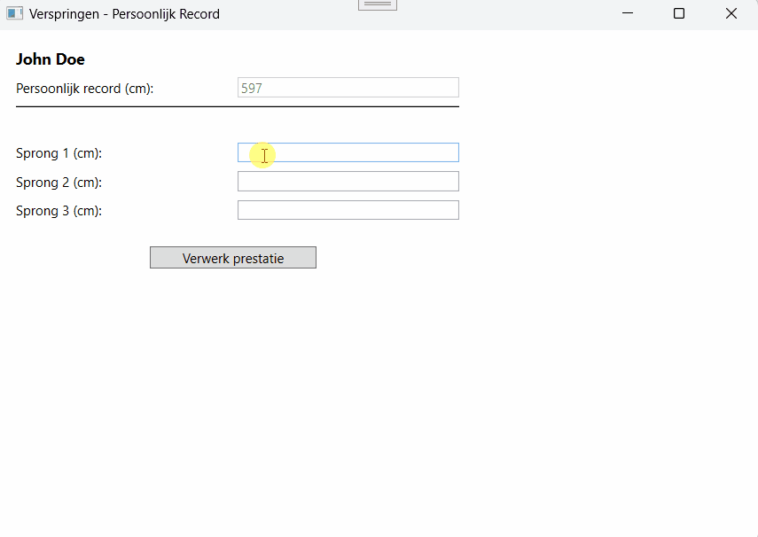
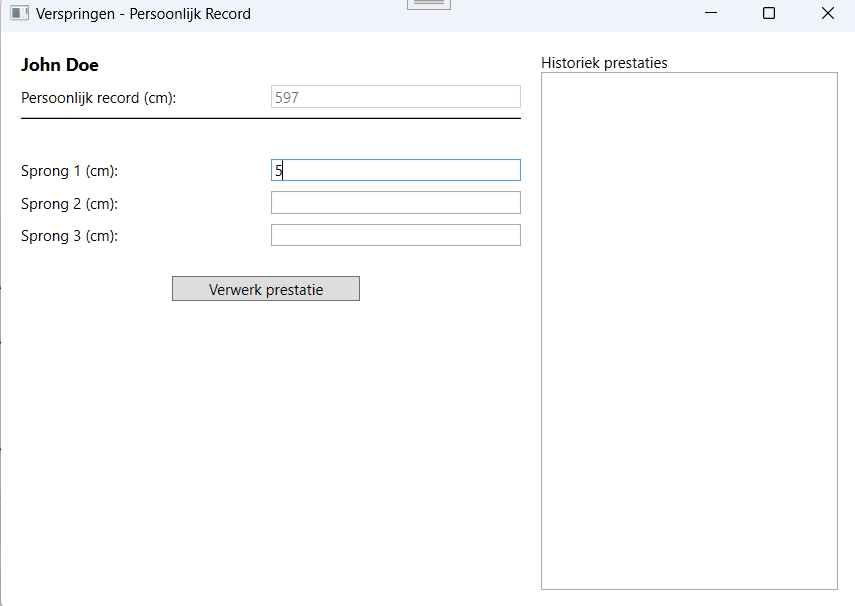

# PE: Verspringen – Persoonlijk Record (WPF, .NET 8, C#)

## Gebruik van AI Tools

Er mag geen enkele AI tool (ChatGPT, GitHub Copilot, …) gebruikt worden voor deze opdracht. Bij twijfel over ongeoorloofd gebruik kan het lectorenteam extra verduidelijking vragen. Ongeoorloofd gebruik leidt tot het opstarten van een fraudedossier conform het onderwijs- en examenreglement, met mogelijke nulscore op één of meer opleidingsonderdelen.

---

## Opdracht

Bouw een **verspringen-calculator** die drie sprongen van een atleet verwerkt en nagaat of het **persoonlijk record (PR)** werd verbeterd.  
De toepassing toont de **beste sprong**, de **gemiddelde sprong**, een **bericht** over het PR, en voegt elke prestatie toe aan een **historiek**.

## Xaml
Bij deze opdracht krijg je de xaml-code. Alle controls zijn reeds aanwezig en hebben reeds een naam.  
Je mag de namen van de controls niet wijzigen.  
Je hoeft ook geen controls toe te voegen.  

**Voeg waar nodig wel de gepaste events toe aan de controls.**

## Basiswerking

1. **Initieel (bij laden venster)**
   - Het veld **Persoonlijk record (cm)** is **alleen-lezen** en wordt **automatisch**  ingevuld met het actuele PR.  
   Bij de start van je applicatie is dit 597cm.
   - Het **statistiekengedeelte** (`grdStats`) is **onzichtbaar**.

2. **Prestatie ingeven**
   - De gebruiker vult **Sprong 1 (cm)**, **Sprong 2 (cm)** en **Sprong 3 (cm)** in.
   - Na ingave van de 3 sprongen kan de gebruiker klikken op de knop **Verwerk prestatie** (`btnShowStats`):
     - Het statistiekengedeelte (`grdStats`) wordt zichtbaar.
     - De drie invoervelden (`txtJump1, txtJump2 en txtJump3`) worden **gedeactiveerd**
     - De **verwerk prestatie-knop** (`btnShowStats`) verdwijnt.

3. **Verwerken van de sprongen**
   - Bepaal en toon **Beste sprong (cm)** (maximum van de drie sprongen) in `lblBestJump`.
   - Bereken en toon **Gemiddelde sprong (cm)** in `lblAverageJump`.
   - Bepaal of er een **nieuw persoonlijk record** is en werk indien van toepassing`txtPR` bij met de nieuwe waarde (in cm).
   - Toon in `lblMessage`:
      - de **3 sprongen** in **meter** met **2 decimalen**,
      - de **gemiddelde sprong** in **meter** met **2 decimalen**,
      - de **verste sprong** in **meter** met **2 decimalen**

4. **Nieuwe prestatie starten**
   - Klik op **Nieuwe prestatie** (`btnNewPerformance`):
     - De drie invoervelden voor de sprongen worden **leeg gemaakt** en zijn **terug actief** (`txtJump1, txtJump2 en txtJump3`) .
     - Verberg het statistiekengedeelte (`grdStats`).
     - Toon de knop **Verwerk prestatie** (`btnShowStats`) opnieuw.
     - Plaats de focus terug op **Sprong 1**.

## Tip

- Om de **Beste sprong (cm)** te bepalen, kan je gebruik maken van de methode: `Math.Max(int val1, int val2)`.  
Deze methode aanvaardt echter maar 2 parameters. Denk na hoe je toch het max. van 3 getallen hiermee kan bepalen...

## Vereisten (code & structuur)
- **Variabelen**  
Kies een passend datatype voor elke variabele. Gebruik zo weinig mogelijk globale variabelen. 
- **Events & methodes**  
  Verwerk alle logica in **aparte methodes**.  
  Alle **logische** methodes zouden ook perfect in een Console-app moeten werken.  
- **Conventies**  
Respecteer alle door 'Howest Programmeren' opgelegde conventies  
(variabelenamen, methodenamen, git-commit-messages)
- **Documenteer** al je logische methodes (dus niet je event-handler-methods) door een **summary** te voorzien.

## Extra’s (optioneel)

> Extra’s leveren enkel punten op als de **basis** volledig correct werkt.
Zonder extra's kan je een score van **12/20** behalen voor de opdracht. 

- Zorg voor een uitgebreidere boodschap in `lblMessage`:
  - **In het geval er een nieuw persoonlijk record is**:  
    De achtergrond van txtPR en lblMessage wordt goudkleurig.  
    *Zorg er ook voor dat de gouden achtergrondkleur bij het ingeven van een nieuwe prestatie terug verdwijnt.*  

    Toon in lblMessage:
    - het vorige PR in meter met 2 decimalen,
    - de verbetering in cm met 2 decimalen,
    - het nieuwe PR in meter met 2 decimalen.

  - **In het geval er geen nieuw persoonlijk record is**:  
    - toon een motiverend bericht met het ongewijzigde PR in meter (2 decimalen).

- Maak `grdHistory` zichtbaar en voeg bij het klikken op de knop **Verwerk prestatie** (`btnShowStats`) de prestatie **bovenaan** toe aan de **Historiek** (`lstHistory`)  met:
     - de **datum**,
     - de **beste sprong (cm)** en (indien van toepassing) **“!!! Nieuw PR !!!”**,
     - alle drie de sprongen in cm,
     - een scheidingslijn.

## Inleveren

- Commit je definitieve versie voor de deadline op de Main-branch van deze repository.  

## Integriteitsnota

Werk **zelfstandig**. Je moet al je code en keuzes kunnen **toelichten**.
